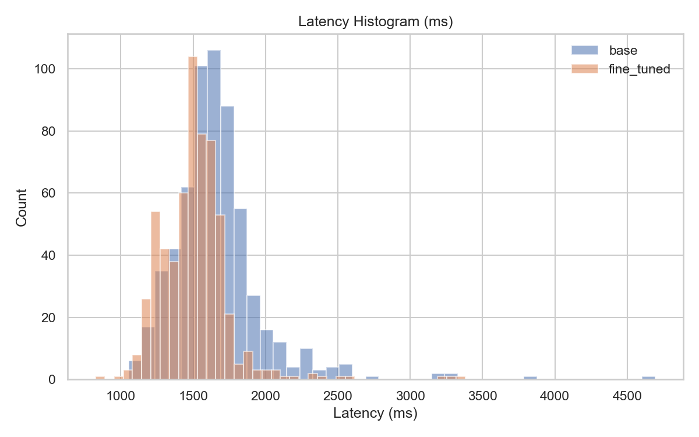
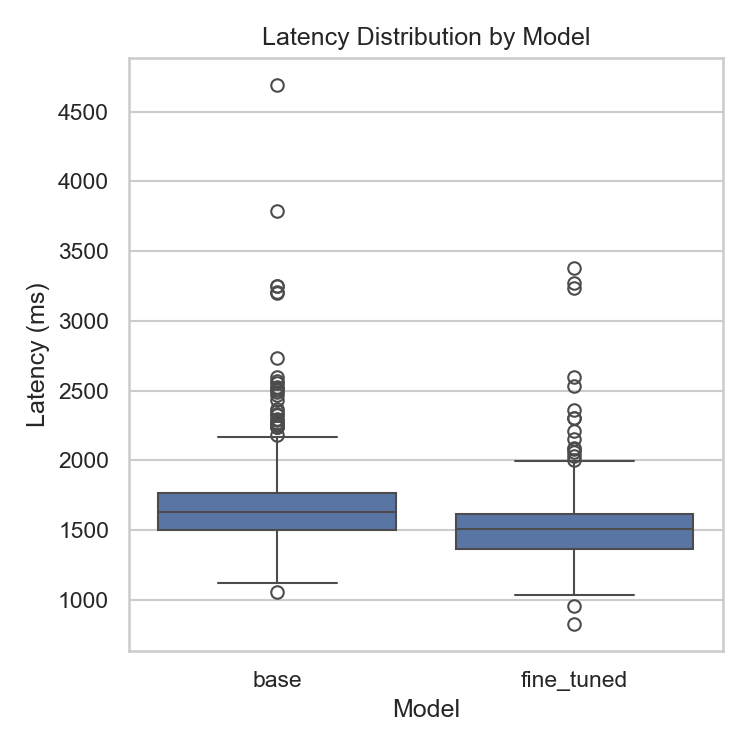

## VLM Image Classification with Fine-Tuning

This project demonstrates how to use a Vision Language Model (VLM) for multi-class image classification (120 dog breeds from the Stanford Dogs dataset), comparing: 
1. Zero-shot classification with a base `gpt-4o-2024-08-06` deployment.  
2. A fine-tuned vision model trained on a reduced subset of the dataset.


### Dataset (Stanford Dogs)
Original dataset stats:
* 120 breeds
* 20,580 images
* Extra annotations (not used here)

For cost control we down-sample to 50 images per breed (6,000 images total) split as: 40 train / 5 val / 5 test per class.

### Repository Structure (trimmed)
```
jsonl/                # Train/val/test JSONL files for fine-tuning + evaluation
public/               # Plots and illustration assets
stanford_dogs_dataset/ # Raw images (down-sampled subset in practice)
images_classification_base_model.ipynb  # End‑to‑end experimentation notebook
results.csv           # Aggregated per-image predictions / metrics
requirements.txt
```

### Key Features
* Zero-shot vs fine-tuned accuracy comparison
* Batch inference via Azure OpenAI Batch API for base model evaluation
* Vision Fine-tuning via Azure OpenAI fine-tuning API (SFT with LoRA)
* Cost estimation methodology (training vs inference vs hosting)
* Metrics: mean accuracy, per-class deltas, confusion analysis (see notebook)

## Results

| Model | Mean Accuracy | Δ vs Base |
|-------|---------------|----------|
| Base `gpt-4o-2024-08-06` (zero-shot) | 73.67% | — |
| Fine-tuned | 82.67% | +9.00 pp |


> The chosen `gpt-4o-2024-08-06` version (September 2025) is the only Azure model supporting both: (a) vision fine-tuning and (b) Batch API with image inputs (base model only).

### Latency Evaluation (Base vs Fine-Tuned)

After accuracy, we compared end-to-end per-request latency (single-threaded, sequential) over the full test set (600 images).

Metrics captured per model:
* total_requests / success_count / error_count
* mean_ms, median_ms (p50)
* p90_ms / p95_ms / p99_ms (tail latency)
* min_ms / max_ms
* std_dev_ms
* throughput_rps_est (sequential approximation)

Methodology:
1. Reconstructed `test_df` (same deterministic sampling logic as training notebook).
2. For each image: issued a `chat.completions.create` call with a low-detail (`detail="low"`) vision prompt.
3. Timed from just before SDK call to response return (blocking) → end-to-end client-observed latency.
4. Simple retry (up to 3 attempts, linear backoff) for transient 429/5xx; failures recorded separately.
5. Visualized distributions using a histogram (per model) and a boxplot.

Measured results (600 sequential requests per model):

| Model | Mean (ms) | P50 (ms) | P90 (ms) | P95 (ms) | P99 (ms) | Min (ms) | Max (ms) | Throughput (req/s) |
|-------|-----------|----------|----------|----------|----------|----------|----------|--------------------|
| Base (`gpt-4o`) | 1665.08 | 1629.17 | 1963.85 | 2182.58 | 2737.33 | 1053.66 | 4693.65 | 0.601 |
| Fine-tuned (`gpt-4o-2024-08-06-ft`) | 1505.97 | 1505.29 | 1706.80 | 1819.48 | 2302.56 | 824.95 | 3381.80 | 0.664 |

Observations:
* Fine-tuned model is faster on average (~9.6% lower mean latency) and shows tighter tail (p99 reduced by ~15.9%).
* Throughput (sequential approximation) is slightly higher for the fine-tuned deployment (0.664 vs 0.601 req/s).
* Lower min and max latencies suggest reduced variance; std dev also decreased (324.15 → 241.33 ms as seen in raw table).

#### Latency Visualizations

  


## Why Fine-Tune?
Zero-shot performance is strong, but fine-tuning yields a consistent uplift (+9 pp mean accuracy) and tighter per-class variance. The gain is moderate given only 2 epochs and a lightweight LoRA setup—additional epochs or data would likely improve it further (with higher cost).

## Reproducibility & Setup

### Prerequisites
* Azure OpenAI resource (with access to vision & fine-tuning features)
* Python 3.10+
* (Optional) Kaggle account if re-downloading the dataset

### Environment
```
python -m venv .venv
./.venv/Scripts/Activate.ps1   # (Windows PowerShell)
pip install -r requirements.txt
```

Create a `.env` file (not committed) with:
```
AZURE_OPENAI_ENDPOINT= https://<your-resource>.openai.azure.com
AZURE_OPENAI_API_KEY= <key>
AZURE_OPENAI_API_VERSION=2024-08-01-preview
BASE_MODEL_DEPLOYMENT=gpt-4o-2024-08-06
# Fill after job completion:
FT_DEPLOYMENT=<your-ft-deployment-name>
```

### Dataset Down-Sampling (Concept)
1. List breeds and shuffle deterministically (seed=42)
2. Pick first 50 images per breed
3. Split 40/5/5 into train/val/test
4. Persist splits into `jsonl/*` for fine-tuning & evaluation

### JSONL Format for Vision Fine-Tuning
Each line is a chat-style object. Example (simplified):
```
{"messages": [
    {"role": "system", "content": "You are a dog breed classifier. Respond with exactly one of: <CLASS LIST>"},
    {"role": "user", "content": [
         {"type": "input_text", "text": "Classify the dog breed."},
         {"type": "input_image", "image_url": {"url": "https://.../image.jpg"}}
    ]},
    {"role": "assistant", "content": [{"type": "output_text", "text": "golden_retriever"}]}
]}
```

### Running the Notebook
Open `images_classification_base_model.ipynb` and execute cells sequentially: 
1. Imports & credentials
2. Dataset preparation & sampling
3. JSONL generation & upload
4. Evaluation on base model through batch inference (not supported with fine-tuned model yet)
5. Fine-tuning job creation & deployment
6. Evaluation on fine-tuned model
7. Comparison between base & fine-tuned models

## Cost Analysis

### Batch Inference
Batch pricing (base model):
* Input: $1.25 / 1M tokens
* Output: $5 / 1M tokens

Test set (600 images):
* System prompt tokens: 494
* Image tokens (detail=low): 85 / image
* Output: ≈6 tokens (label)
* Approx input tokens cost recorded: $0.56; output: $0.03 → Total ≈ $0.59 (~$0.00098/image)

### Fine-Tuning Costs
Components:
* One-time training job (token-based)
* Hosting (hourly) while deployment is active
* Inference (per 1M tokens) post-deployment

Pricing (gpt-4o-2024-08-06, East US 2, Sept 2025 reference):
* Training: $27.5 / 1M training tokens
* Hosting: $1.7 / hour
* Inference: $2.5 / 1M input, $10 / 1M output (global standard)

Training token calculation (2 epochs, 4,800 training images):
```
Per example tokens ≈ system (494) + image (85) + target (≈6) = 585
Examples per epoch = 40 * 120 = 4,800
Tokens per epoch = 585 * 4,800 = 2,808,000
Epochs = 2 → Total = 5,616,000 tokens = 5.616M
Training cost ≈ 5.616 * 27.5 ≈ $155
```


> Note: you can observe a small difference between the calculated cost and the cost shown in the screenshot above. It's because in the calculation I'm using an approximation of the output tokens that are not always the same number (based on the input). I've chosen 6 as it was the most approximate integer to represent the entire distribution.

### Interpreting the Trade-Off
* Accuracy: +9 pp mean accuracy uplift (73.67% → 82.67%) – materially fewer misclassifications across 120 classes.
* Latency: Mean latency dropped ~9.6% (1665 → 1506 ms) and tail improved (p99 -15.9%, 2737 → 2303 ms). Lower variance (std dev 324 → 241 ms) means more predictable response times.
* Throughput: Sequential effective throughput rose from 0.601 → 0.664 req/s (~10% gain); in a real concurrent setting this compounds capacity benefits.
* User experience: Faster and tighter latency distribution reduces perceived lag and long-tail stalls; fewer outliers (max 4694 → 3382 ms).
* Cost: Token pricing per inference is similar; incremental hosting + one‑time training cost must be amortized over projected inference volume. Latency gains may offset some cost by enabling higher sustained QPS on the same client/service budget.
* Risk/Complexity: Fine-tuning introduces lifecycle tasks (versioning, retraining as drift occurs, monitoring). Decide if operational overhead is justified by accuracy + latency improvements for downstream workflows (routing, tagging, enrichment).
* ROI Trigger: Fine-tune is most justified if misclassification carries downstream manual review cost or latency improvements unlock tighter SLAs.

## Conclusion
The fine-tuned model improves accuracy while remaining cost-manageable using a low-epoch LoRA-based SFT. 

Further gains would likely require: more images, curriculum or hard-negative mining, additional epochs, or prompt refinement. Balance marginal accuracy vs added operational cost.

## Disclaimer
Costs and pricing are illustrative and may change. Always consult current [Azure OpenAI pricing](https://azure.microsoft.com/en-us/pricing/details/cognitive-services/openai-service/) before large-scale runs.